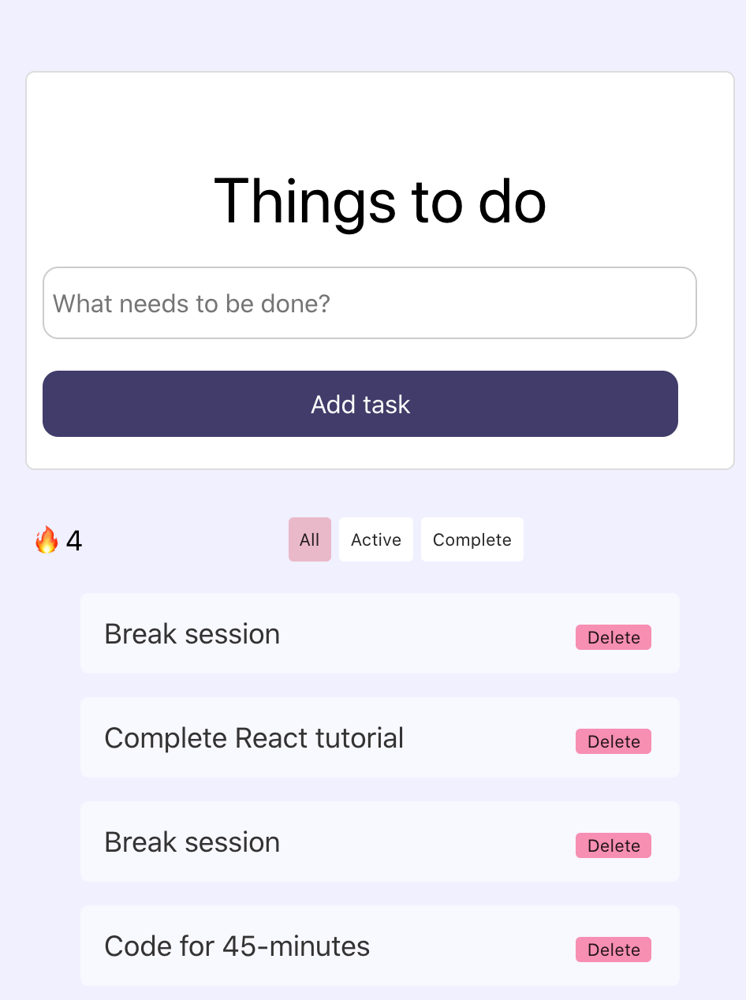

# Commit 

## Link to app

* https://commit.jknox24.now.sh/

## Summary

Commit is a simple solution for building healthier coding habits. Designed for entry-level software engineers. Learning how to code can be exhausting. Earn your streaks by taking breaks after completing coding sessions.

## Technologies Used

* Commit is built on React using HTML, CSS, and Javascript 
* Commit's backend is built on Express.js

 
